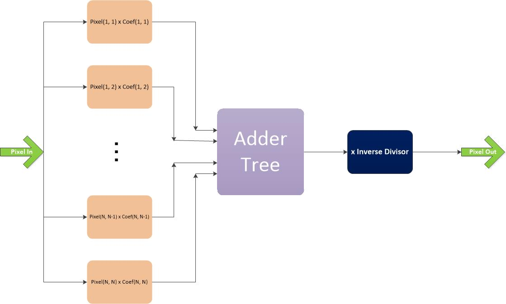
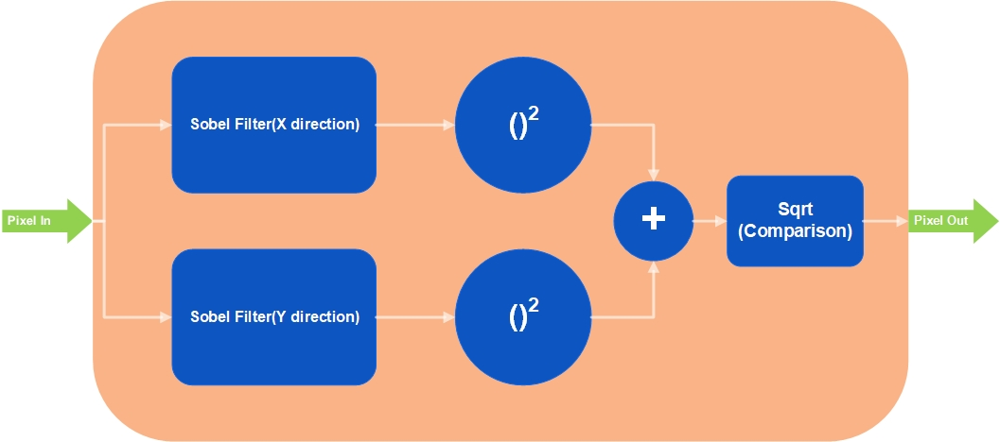
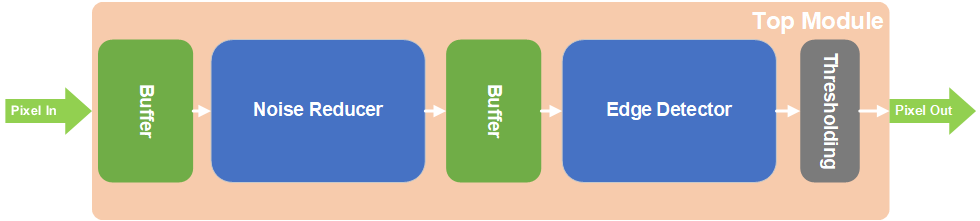
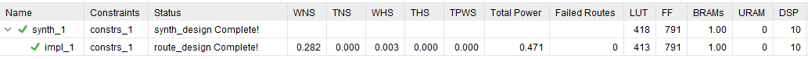
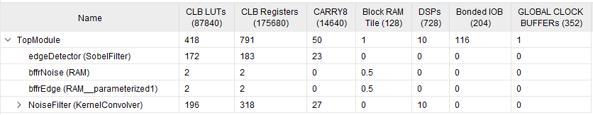
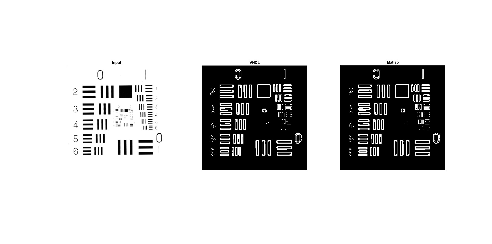
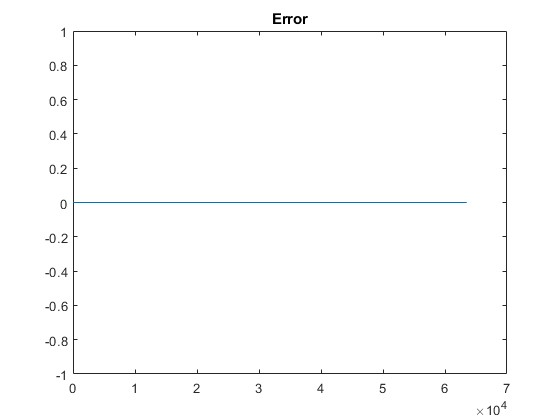

# VHDL-Based Edge Detection System

This repository presents a fully pipelined and synthesizable hardware implementation of a grayscale image edge detection system using VHDL. The design includes modular components for kernel-based denoising and Sobel-based edge detection. Verification is done using MATLAB and ModelSim, and the design is synthesized and implemented using Vivado.

---

##  Repository Structure
Edge-Detection-VHDL/

├── sim/ # ModelSim simulation environment

├── source/ # VHDL source files

├── tcl/ # ModelSim tcl file

├── test/ # Testbench vhdl and matlab files

├── vivado/ # Vivado implementation project

├── docs/ # Block diagrams and illustrations

└── README.md

---

##  Module Descriptions

### `MyPackage.vhd`

This package defines reusable types for 2D image and coefficient representations:

- `std_logic_vector_array`
- `unsigned_array`
- `unsigned_matrix`
- `signed_array`
- `signed_matrix`

These types support scalable and readable matrix-based image processing.

---

### `Multiplier.vhd`

Implements a DSP48E2-based multiply-add operation with 4-clock latency.

**Function:**  
`P = A * B + C`

- A: 27-bit signed input  
- B: 18-bit signed input  
- C: 48-bit signed input  
- P: 48-bit signed output  

**Implementation Details:**

- Latency: 4 clock cycles  
- DSP Usage: 1 slice

---

### `KernelConvolver.vhd`

Performs a 3x3 kernel convolution on an 8-bit image patch using a signed coefficient matrix.

**Inputs:**

- `pixelIn`: 3x3 unsigned matrix (8-bit values)  
- `coef`: 3x3 signed matrix (`coefWidth`-bit values)
- `inverse_divisor`: unsigned array (17-bit value)

**Operation:**

- 9 parallel `Multiplier` instances perform element-wise multiplication.
- Results are summed using an adder tree.
- The sum is then normalized by multiplying with the inverse of the coefficient matrix's total sum (using 16-bit fixed-point precision).

**Normalized Output:**  
`pixelOut = (sum of element-wise products) * (1 / sum of coeff_matrix)`

- Output: Single 8-bit unsigned pixel  
- Latency: 13 clock cycles  
- DSP Usage: 10 (9 for convolution + 1 for normalization)

  
  
<b>Figure 1:</b> Kernel Convolver Diagram

---

### `SobelFilter.vhd`

Calculates edge strength using the Sobel operator on a 3x3 grayscale patch.

**Gradient Calculations:**

- Gx = (p02 + 2*p12 + p22) - (p00 + 2*p10 + p20)  
- Gy = (p20 + 2*p21 + p22) - (p00 + 2*p01 + p02)

**Magnitude Estimation:**  
`G = abs(Gx) + abs(Gy)`

**Features:**

- No DSP used (multiplications implemented as shifts)  
- Latency: 5 clock cycles

  
  
<b>Figure 2:</b> Sobel Filter Diagram

---

### `RAM.vhd`

Implements a synchronous dual-port RAM with configurable depth and word length.

**Key Features:**

- Generic parameters: `cellnum` and `wordLength`  
- Read latency: 2 clock cycles  
- Synthesizer hint to infer BRAMs  
- Used as line buffer between processing stages

---

### `TopModule.vhd`

The top-level module integrates all subsystems in a pipelined architecture.

**Data Flow:**

1. Input: 8-bit grayscale pixels (received line by line).
2. Line buffering with `RAM`.
3. Denoising with `KernelConvolver`.
4. Another buffering stage with `RAM`.
5. Edge detection with `SobelFilter`.
6. Thresholding: converts to binary output.

**Output Resolution:**  
If input image is N x M, output will be (N - 4) x (M - 4), due to two 3x3 convolution operations (no padding, stride = 1).

**Pipeline Latency:** 19 clock cycles + buffering.  
**Output Format:** 1-bit binary (1 = edge, 0 = non-edge).  
**Synthesis Frequency:** 650 MHz  
**DSP Usage:** 10  
**Memory Usage:** Efficient use of BRAM for buffering (e.g., for width=256, only 1 BRAM needed compared to ~8k flip-flops with shift registers).

  
  
<b>Figure 3:</b> Top Module Diagram

 

---

##  MATLAB-Based Verification

Located in the `matlab/` folder.

**Testing Procedure:**

1. Load input image.
2. Convert image to fixed-point and simulate denoising and edge detection steps.
3. Generate `input.txt` for VHDL testbench.
4. Run ModelSim to simulate the VHDL code.
5. VHDL reads input from `input.txt` and writes result to `output.txt`.
6. MATLAB compares the VHDL output with the expected result and displays them.

Optional:
- Code for random input generation is included (commented out by default).

---

## Implementation Details

The design was synthesized and implemented using Vivado. Post-implementation reports confirm that the target timing requirements are satisfied while maintaining very low resource utilization and power consumption. Despite operating at high frequency, the architecture requires only a small number of FPGA resources, demonstrating the efficiency of the proposed pipelined implementation.

  
  
<b>Figure 4:</b> Vivado synthesis and implementation summary

To further analyze the hardware cost distribution, the post-implementation utilization report is shown below. The report provides a module-level breakdown of FPGA resource consumption, highlighting the contribution of each subsystem to the overall design footprint.

  
  
<b>Figure 5:</b> Hierarchical resource utilization report showing the distribution of LUTs, flip-flops, BRAMs, DSPs, and other FPGA resources across the design modules.

---

## MATLAB and VHDL Output Comparison

Functional verification was performed by comparing the hardware-generated output against the MATLAB fixed-point reference model. The comparison demonstrates that the synthesized VHDL implementation reproduces the expected behavior exactly.

  
  
<b>Figure 6:</b> Representative verification example. From left to right: the input grayscale image, the MATLAB reference output, and the corresponding VHDL output obtained from simulation. 

To quantitatively validate the equivalence between both implementations, the number of mismatched pixels was evaluated. As shown below, the error metric remains zero for all tested samples, indicating perfect agreement between the MATLAB model and the VHDL design.

  
  
<b>Figure 7:</b> Pixel mismatch analysis between MATLAB and VHDL outputs

---

##  System Characteristics

| Feature                  | Value                    |
|--------------------------|--------------------------|
| Input Format             | 8-bit grayscale pixels   |
| Output Format            | 1-bit binary image       |
| Latency                  | 19 clock cycles          |
| Synthesized Frequency    | 650 MHz                  |
| Example Runtime          | ~400 microseconds (512x512 image) |
| DSP Resources Used       | 10                       |
| BRAM Usage               | Depends on picture width |
| Scalability              | High (fully pipelined)   |
| Optimization Bottleneck  | Serial input rate        |

---

##  Tools Used

| Tool         | Purpose                             |
|--------------|-------------------------------------|
| Vivado       | Synthesis, timing, implementation   |
| ModelSim     | VHDL simulation                     |
| MATLAB       | Fixed-point modeling and validation |
| GitHub       | Version control                     |

---

##  Future Improvements

Given the low resource utilization of the current design (only 10 DSP slices and minimal BRAM usage), there is significant potential for enhancing performance through parallelization. Currently, the primary bottleneck lies in the input bandwidth, as the system processes one pixel per clock cycle.

To fully exploit parallel processing and increase throughput, the following enhancements are proposed:

- **Parallel Pixel Input Support**: Modify the design to accept multiple pixels per clock cycle, enabling concurrent processing of multiple convolution windows.
- **AXI4-Stream Interface Integration**: Adopt standard high-throughput streaming interfaces for seamless integration with modern SoC environments.

These improvements would allow the system to scale efficiently with available hardware resources, providing faster image processing suitable for real-time applications.

---

##  Author

**Hadi Salavati**
